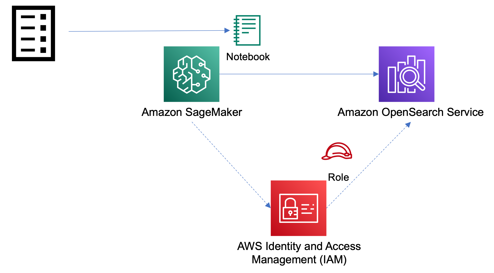

# Measuring relevance in Amazon OpenSearch Service

This repository is an accompaniment to the blog post "Measuring relevance in Amazon OpenSearch Service" published on the AWS Big Data Blog. 

## Architecture diagram




## Deployment

- Deploy the Cloudformation template "" in eu-east-1 (N.Virginia)

- Open the SageMaker Notebook "MeasuringRelevanceNotebook". 

- Open the measureRelevance.ipynb and follow the steps as you progress through the blog post. 

## Cleanup

- Delete the two CloudFormation stack "MeasureRelevanceStack" though the console or CLI.

```bash
aws cloudformation delete-stack --stack-name MeasureRelevanceStack
```